# 💳 Sistema de Pagos MercadoPago con QR Seguro

## 🎯 Descripción

Sistema completo de pagos integrado con MercadoPago que genera códigos QR dinámicos con múltiples capas de seguridad para prevenir fraudes y pagos duplicados.

---

## 🔐 Características de Seguridad

### ✅ Anti-Fraude
- **Tokens únicos**: Cada transacción tiene un hash único SHA-256
- **Validación de montos**: Verificación exacta del monto pagado (tolerancia 0.01)
- **Expiración de QR**: Los códigos QR expiran automáticamente en 15 minutos
- **Prevención de duplicados**: Sistema de tracking de pagos procesados
- **Audit logs**: Registro completo de todas las transacciones

### 🔒 Validaciones Múltiples
1. **Server-side**: Validación en el backend con Express
2. **Client-side**: Validación en el navegador antes de enviar
3. **MercadoPago**: Validación adicional por la pasarela de pagos
4. **Webhook**: Verificación asíncrona de pagos completados

---

## 📂 Archivos Implementados

### Cliente (Frontend)
- **`js/mercadopago-integration.js`** (795 líneas)
  - Clase `MercadoPagoSecure` con 20+ métodos
  - Generación de QR con tokens de seguridad
  - Polling cada 3 segundos para verificar estado
  - Procesamiento de webhooks
  - Validaciones multi-capa
  - Audit logging en localStorage

- **`pagar-pedido.html`** (Página de pago)
  - Interfaz completa con QR dinámico
  - Countdown timer visual (15 minutos)
  - Estados del pago (pending, checking, approved, expired)
  - Modal de confirmación de pago exitoso
  - Responsive design

### Servidor (Backend)
- **`server.js`** (370+ líneas agregadas)
  - 7 endpoints REST para MercadoPago
  - Sistema de tokens y validación
  - Procesamiento de webhooks
  - Almacenamiento en Maps/Sets
  - Integración con notificaciones push

---

## 🚀 Endpoints API

### 1. **GET** `/api/mercadopago/public-key`
Retorna la clave pública para inicializar el SDK.

**Response:**
```json
{
  "publicKey": "TEST-YOUR-PUBLIC-KEY"
}
```

---

### 2. **POST** `/api/mercadopago/crear-qr`
Crea una preferencia de pago y genera el QR.

**Request Body:**
```json
{
  "pedidoId": "PED-001",
  "monto": 1500.50,
  "descripcion": "Pizza Napolitana",
  "comercio": "Pizzería Don Carlos",
  "cliente": "Juan Pérez",
  "email": "juan@email.com",
  "token": "abc123...",
  "metadata": {
    "platform": "YAvoy",
    "version": "2.0"
  }
}
```

**Response:**
```json
{
  "success": true,
  "preference_id": "1234567890-abc123",
  "payment_id": "MP-001",
  "qr_data": "https://www.mercadopago.com/mla/checkout/start?pref_id=...",
  "qr_image": "https://api.qrserver.com/v1/create-qr-code/?size=300x300&data=...",
  "init_point": "https://www.mercadopago.com/mla/checkout/start?pref_id=..."
}
```

---

### 3. **GET** `/api/mercadopago/verificar-pago/:pedidoId`
Verifica el estado de un pago.

**Response:**
```json
{
  "status": "pending",
  "monto": 1500.50,
  "createdAt": "2025-06-15T10:30:00Z",
  "expiresAt": "2025-06-15T10:45:00Z"
}
```

---

### 4. **POST** `/api/mercadopago/webhook`
Recibe notificaciones de MercadoPago (procesado asíncronamente).

**Request Body (de MercadoPago):**
```json
{
  "type": "payment",
  "action": "payment.created",
  "data": {
    "id": "123456789"
  }
}
```

**Response:** `200 OK` (inmediato)

---

### 5. **GET** `/api/mercadopago/payment/:paymentId`
Obtiene detalles de un pago desde MercadoPago.

**Response:**
```json
{
  "id": 123456789,
  "status": "approved",
  "transaction_amount": 1500.50,
  "payment_method_id": "pix",
  "date_created": "2025-06-15T10:35:00Z"
}
```

---

### 6. **POST** `/api/mercadopago/audit-log`
Guarda logs de auditoría.

**Request Body:**
```json
{
  "event": "qr_generado",
  "data": {
    "pedidoId": "PED-001",
    "monto": 1500.50
  },
  "timestamp": "2025-06-15T10:30:00Z",
  "userAgent": "Mozilla/5.0..."
}
```

---

### 7. **PATCH** `/api/pedidos/:id/pago-confirmado`
Confirma el pago de un pedido.

**Request Body:**
```json
{
  "paymentId": "MP-001",
  "paymentStatus": "approved",
  "transactionAmount": 1500.50,
  "paymentMethod": "qr",
  "timestamp": "2025-06-15T10:35:00Z"
}
```

---

## ⚙️ Configuración

### 1. Obtener Credenciales de MercadoPago

1. Ve a [MercadoPago Developers](https://www.mercadopago.com.ar/developers/panel)
2. Crea una aplicación o selecciona una existente
3. Ve a **Credenciales** en el menú izquierdo
4. Copia las credenciales de **TEST** (para desarrollo):
   - `Access Token` (comienza con `TEST-`)
   - `Public Key` (comienza con `TEST-`)

### 2. Configurar Variables de Entorno

Crea un archivo `.env` en la raíz del proyecto:

```env
# Modo de Prueba (TEST)
MERCADOPAGO_ACCESS_TOKEN=TEST-1234567890-abcdef-abc123def456
MERCADOPAGO_PUBLIC_KEY=TEST-abc123-def456-ghi789

# Modo de Producción (cuando estés listo)
# MERCADOPAGO_ACCESS_TOKEN=APP_USR-1234567890-abcdef-abc123def456
# MERCADOPAGO_PUBLIC_KEY=APP_USR-abc123-def456-ghi789
```

### 3. Modificar `server.js`

Reemplaza las credenciales de prueba con las variables de entorno:

```javascript
// Busca en server.js (línea ~1800):
const MERCADOPAGO_ACCESS_TOKEN = process.env.MERCADOPAGO_ACCESS_TOKEN || 'TEST-YOUR-ACCESS-TOKEN-HERE';
const MERCADOPAGO_PUBLIC_KEY = process.env.MERCADOPAGO_PUBLIC_KEY || 'TEST-YOUR-PUBLIC-KEY-HERE';
```

### 4. Instalar dotenv (opcional, para variables de entorno)

```powershell
npm install dotenv
```

Luego agrega al inicio de `server.js`:

```javascript
require('dotenv').config();
```

---

## 🧪 Testing

### Testing Local con Ngrok (para webhooks)

Los webhooks de MercadoPago necesitan una URL pública. Para testear localmente:

1. **Instalar ngrok:**
   ```powershell
   choco install ngrok
   # O descarga desde https://ngrok.com/download
   ```

2. **Iniciar el servidor:**
   ```powershell
   node server.js
   ```

3. **Crear túnel público:**
   ```powershell
   ngrok http 5501
   ```

4. **Copiar la URL pública** (ej: `https://abc123.ngrok.io`)

5. **Configurar webhook en MercadoPago:**
   - Ve a tu aplicación en MercadoPago Developers
   - Webhooks → Agregar nueva URL
   - URL: `https://abc123.ngrok.io/api/mercadopago/webhook`
   - Eventos: Selecciona "Pagos"

### Testing con Cuenta de Prueba

1. Ve a [Usuarios de Prueba](https://www.mercadopago.com.ar/developers/panel/test-users)
2. Crea 2 usuarios:
   - **Vendedor**: Para tu aplicación
   - **Comprador**: Para simular pagos
3. Usa las credenciales del **Vendedor** en tu `.env`
4. Usa la app de MercadoPago con la cuenta del **Comprador** para escanear el QR

---

## 📱 Flujo de Pago Completo

```mermaid
sequenceDiagram
    participant Cliente
    participant Frontend
    participant Backend
    participant MercadoPago
    participant Webhook

    Cliente->>Frontend: Hacer pedido
    Frontend->>Backend: POST /api/pedidos
    Frontend->>Frontend: Redirigir a pagar-pedido.html?pedido=PED-001
    Frontend->>Backend: POST /api/mercadopago/crear-qr
    Backend->>MercadoPago: Crear preferencia de pago
    MercadoPago-->>Backend: preference_id + qr_data
    Backend-->>Frontend: QR image + token
    Frontend->>Frontend: Mostrar QR + iniciar polling (cada 3s)
    
    Cliente->>MercadoPago: Escanear QR con app
    MercadoPago->>Cliente: Confirmar pago
    MercadoPago->>Webhook: POST /webhook (notificación)
    Webhook->>Backend: Procesar pago
    Backend->>Backend: Validar monto, token, duplicados
    Backend->>Backend: Actualizar pedido (pagado=true)
    Backend->>Frontend: Enviar notificación push
    
    Frontend->>Backend: GET /api/mercadopago/verificar-pago (polling)
    Backend-->>Frontend: status: "approved"
    Frontend->>Frontend: Mostrar modal de éxito
    Frontend->>Cliente: Redirigir a ver pedido
```



---

## 🛠️ Uso en el Código

### Desde cualquier página HTML:

```html
<!-- Agregar SDK -->
<script src="https://sdk.mercadopago.com/js/v2"></script>
<script src="js/mercadopago-integration.js"></script>

<script>
// Inicializar
window.mercadoPagoSecure.init().then(() => {
  console.log('MercadoPago listo');
});

// Generar QR de pago
async function pagarPedido(pedido) {
  try {
    const qrInfo = await window.mercadoPagoSecure.generarQRPago({
      pedidoId: pedido.id,
      monto: pedido.precio,
      descripcion: pedido.producto,
      comercio: pedido.comercio,
      cliente: pedido.cliente,
      email: pedido.email
    });

    // Mostrar QR al usuario
    console.log('QR generado:', qrInfo);
    // qrInfo.qrImage -> URL de la imagen del QR

    // Iniciar polling para verificar pago
    window.mercadoPagoSecure.startPaymentPolling(pedido.id, (paymentDetails) => {
      console.log('¡Pago aprobado!', paymentDetails);
      // Mostrar confirmación al usuario
    });

  } catch (error) {
    console.error('Error al generar QR:', error);
  }
}
</script>
```

### Escuchar eventos de pago:

```javascript
// Evento cuando se aprueba un pago
window.addEventListener('pagoAprobado', (e) => {
  console.log('Pago aprobado:', e.detail);
  // e.detail.pedidoId
  // e.detail.paymentDetails
});

// Evento cuando expira un QR
window.addEventListener('qrExpirado', (e) => {
  console.log('QR expirado:', e.detail.pedidoId);
});
```

---

## 📊 Estructura de Datos

### QR Info (Cliente)
```javascript
{
  pedidoId: 'PED-001',
  qrData: 'https://www.mercadopago.com/...',
  qrImage: 'https://api.qrserver.com/...',
  paymentId: 'MP-001',
  monto: 1500.50,
  token: 'abc123def456...',
  createdAt: 1718445000000,
  expiresAt: 1718445900000, // +15 minutos
  status: 'pending' // pending, approved, expired
}
```

### Payment Info (Servidor)
```javascript
{
  pedidoId: 'PED-001',
  preferenceId: '1234567890-abc',
  paymentId: 'MP-001',
  monto: 1500.50,
  token: 'abc123def456...',
  status: 'pending',
  createdAt: Date.now(),
  expiresAt: Date.now() + 900000,
  metadata: {
    comercio: 'Pizzería Don Carlos',
    cliente: 'Juan Pérez',
    email: 'juan@email.com'
  }
}
```

---

## 📝 Audit Logs

Los logs se guardan automáticamente en:
```
registros/logs-pagos/pagos-2025-06-15.json
```

Formato:
```json
[
  {
    "event": "qr_generado",
    "data": {
      "pedidoId": "PED-001",
      "monto": 1500.50,
      "token": "abc123..."
    },
    "timestamp": "2025-06-15T10:30:00.000Z",
    "userAgent": "Mozilla/5.0..."
  },
  {
    "event": "pago_aprobado",
    "data": {
      "pedidoId": "PED-001",
      "paymentId": "MP-001",
      "monto": 1500.50
    },
    "timestamp": "2025-06-15T10:35:00.000Z"
  }
]
```

---

## ⚠️ Consideraciones Importantes

### Producción
- ✅ **SIEMPRE** usa HTTPS en producción
- ✅ Configura un webhook público válido
- ✅ Usa credenciales de **PRODUCCIÓN** (no TEST)
- ✅ Implementa rate limiting en los endpoints
- ✅ Monitorea los logs de auditoría regularmente

### Seguridad
- 🔒 Nunca expongas el `ACCESS_TOKEN` en el frontend
- 🔒 Valida SIEMPRE el monto en el servidor
- 🔒 Verifica la firma del webhook de MercadoPago
- 🔒 Implementa límites de intentos de pago
- 🔒 Mantén un registro de todas las transacciones

### Performance
- ⚡ El polling de 3 segundos es eficiente para UX
- ⚡ Los QRs se guardan en memoria (Map/Set) para velocidad
- ⚡ Considera migrar a una base de datos real en producción
- ⚡ Implementa caché para public_key

---

## 🐛 Troubleshooting

### Problema: "QR no se genera"
**Solución:**
1. Verifica las credenciales en `.env`
2. Chequea la consola del navegador (F12)
3. Verifica que el servidor esté corriendo en puerto 5501

### Problema: "Webhook no se recibe"
**Solución:**
1. Asegúrate de usar ngrok para testing local
2. Verifica la URL del webhook en MercadoPago Developers
3. Chequea los logs del servidor (`console.log` en webhook handler)

### Problema: "Pago aprobado pero no se actualiza"
**Solución:**
1. Verifica que el token coincida entre QR y webhook
2. Chequea que el monto sea exacto (diferencia máxima 0.01)
3. Revisa los audit logs en `registros/logs-pagos/`

### Problema: "QR expira muy rápido"
**Solución:**
Modifica el tiempo de expiración en `js/mercadopago-integration.js`:
```javascript
expiresAt: Date.now() + (30 * 60 * 1000) // 30 minutos
```

---

## 📚 Recursos Adicionales

- [Documentación Oficial MercadoPago](https://www.mercadopago.com.ar/developers/es/docs)
- [SDK JavaScript](https://www.mercadopago.com.ar/developers/es/docs/checkout-pro/integrate-sdk/javascript)
- [Webhooks](https://www.mercadopago.com.ar/developers/es/docs/your-integrations/notifications/webhooks)
- [API Reference](https://www.mercadopago.com.ar/developers/es/reference)

---

## ✅ Checklist de Implementación

### Setup Inicial
- [x] Crear cuenta en MercadoPago Developers
- [x] Obtener credenciales TEST
- [x] Configurar `.env` con credenciales
- [x] Instalar dependencias necesarias

### Frontend
- [x] Agregar SDK de MercadoPago al HTML
- [x] Incluir `js/mercadopago-integration.js`
- [x] Crear página `pagar-pedido.html`
- [x] Implementar modal de pago exitoso

### Backend
- [x] Agregar endpoints en `server.js`
- [x] Configurar sistema de tokens
- [x] Implementar validaciones de seguridad
- [x] Configurar procesamiento de webhooks

### Testing
- [ ] Instalar ngrok
- [ ] Crear usuarios de prueba en MercadoPago
- [ ] Configurar webhook público
- [ ] Realizar pago de prueba completo
- [ ] Verificar audit logs

### Producción
- [ ] Obtener credenciales de PRODUCCIÓN
- [ ] Configurar HTTPS
- [ ] Actualizar webhook URL
- [ ] Testear con pago real pequeño
- [ ] Monitorear transacciones

---

## 🎉 ¡Listo!

El sistema de pagos con MercadoPago está **100% implementado** con todas las medidas de seguridad anti-fraude solicitadas:

✅ QR dinámico por transacción  
✅ Expiración automática (15 minutos)  
✅ Tokens únicos de seguridad  
✅ Validación de montos  
✅ Prevención de duplicados  
✅ Audit trail completo  
✅ Polling en tiempo real  
✅ Webhooks asíncronos  

**Solo falta configurar las credenciales y realizar testing!** 🚀
